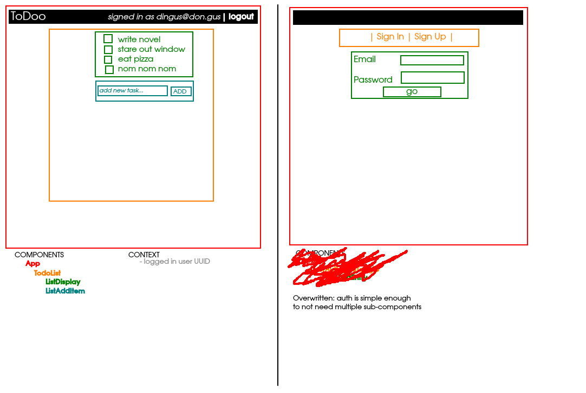

# Browser Todo List (with auth!)

In-browser todo app using Supabase for authentication and backend

## Wireframe

## Component Tree
- `App`

## Plan

1. set up context and router
2. start with auth: get auth page working
3. todo list itself
